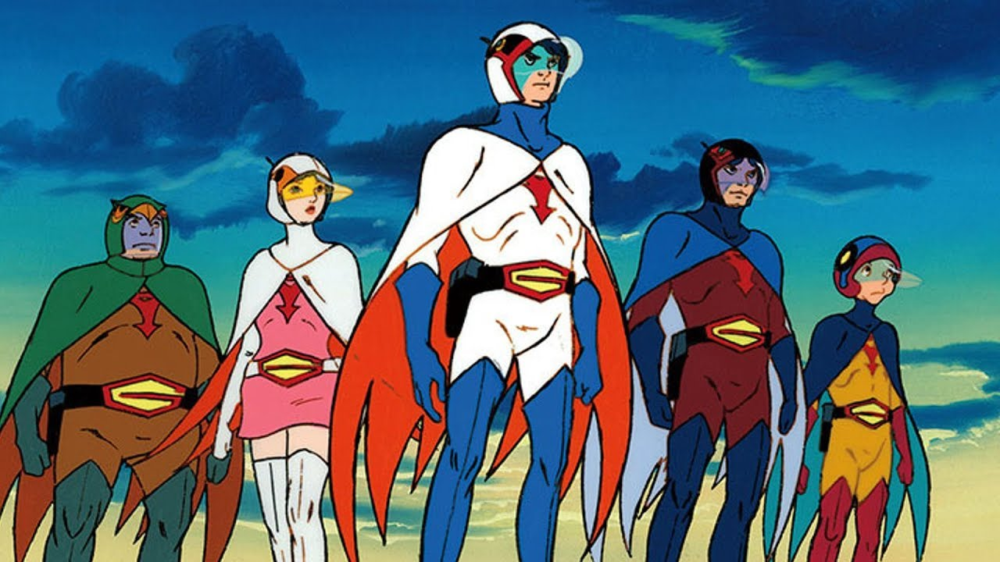

- #tft, #SPD, #ConceptMapping, #KnowledgeCartography, #VisualThinking, #HOT, #PD
- 20/1/22
- What is a [[concept map]]?
- Why use [[concept maps]]?
- ### What's the difference between concept maps and mind maps? 
  Relationships
	-
	- Spacing?
	-
- # Tools for concept mapping
	- ## MindMup
	- ## Cmap Tools
- Why [[IHMC]]?
- Use a concept map to teach about concept maps
- Levels of concept map
	- From lower-order to higher-order
- Characteristics of a higher-order CM
- ICT for HOT
- Multiple variations possible
- Steps to making a HOT Concept Map 
  Vocabulary List
	- Learning Goals
- Features of a Concept Map (and terminology)
	- Nodes
		- Single nodes
		- Hierarchical/Nested nodes
	- Relationships
		- uni-directional / one-way arrows
		- bi-directional / two-way arrows
		- 1 to 1
		- 1 to many
		- many to 1
- Examples
	- Biology - Photosynthesis
- https://cmap.ihmc.us/docs/itinerary.php?url=https://cmapscloud.ihmc.us/viewer/cmap/1TBL5KVT9-1C55C31-4TF8&title=%3Cimg%20src%3D%22%2Fdocs%2Fimg%2Fbuild-concept-maps.png%22%20width%3D%22100%25%22%20border%3D%220%22%3E
- !https://cmap.ihmc.us/docs/itinerary.php?url=https://cmapscloud.ihmc.us/viewer/cmap/1TBL5KVT9-1C55C31-4TF8&title=%3Cimg%20src%3D%22%2Fdocs%2Fimg%2Fbuild-concept-maps.png%22%20width%3D%22100%25%22%20border%3D%220%22%3E
- ! @@html: https://cmap.ihmc.us/docs/itinerary.php?url=https://cmapscloud.ihmc.us/viewer/cmap/1TBL5KVT9-1C55C31-4TF8&title=%3Cimg%20src%3D%22%2Fdocs%2Fimg%2Fbuild-concept-maps.png%22%20width%3D%22100%25%22%20border%3D%220%22%3E@@
- 
-